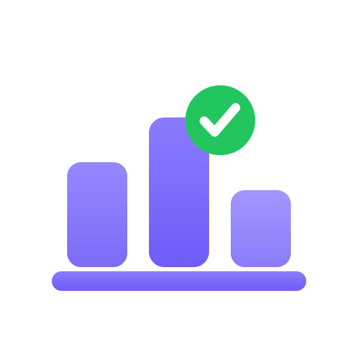

<div align="center">



# Podium Studio

### Automation testing anyone can run.

**Author and run deterministic mobile + web end-to-end tests — without writing code.**
Built so an intern, a junior QA, or an engineer with zero automation background can
successfully test a *complex* app on day one.

[](https://github.com/hoainho/podium-studio/actions/workflows/ci.yml)

-blueviolet)


[**🌐 Landing page**](https://hoainho.github.io/podium-studio/) · [Architecture](docs/ARCHITECTURE.md) · [Authoring guide](docs/AUTHORING.md) · [Web testing](docs/WEB-TESTING.md) · [Changelog](CHANGELOG.md)

</div>

---

## Why Podium Studio

Automation is usually **gatekept by experts** — you need to know a framework, selectors,
async waits, CI. So most manual testers can't automate, tests rot, and coverage stalls.

Podium Studio removes the gate. You describe what you'd do by hand — *tap this, type that,
check that this appears* — and it runs as a real, deterministic test on a device or in a
browser, with screenshots and video as proof. Onboarding is measured in **minutes, not weeks**.

> The goal: a first-day tester ships a working end-to-end test of a complex app — and the
> whole team's testing gets faster, more repeatable, and far cheaper to maintain.

## Built for every role

| | How fast they succeed |
|---|---|
| 🧑‍🎓 **Intern / first job** | Writes their first real E2E test in an afternoon — no framework to learn. |
| 🧪 **Manual / junior QA** | Turns the manual scripts they already run into automated, repeatable checks. |
| 👩‍💻 **Engineer** | Skips the boilerplate; gets deterministic runs + full traces to debug fast. |

## Features

- ✍️ **No-code authoring** — plain steps (`tap` / `type` / `check`), a one-line "what could go
  wrong?" charter, and nudges that stop you from asserting nothing.
- 📱 **Deterministic mobile E2E** — iOS Simulator + Android via the Podium engine. Same flow,
  same actions, every run. **No AI in the run path.**
- 🌐 **Real web E2E that actually works** — resolves elements **across iframes**, auto-dismisses
  **cookie/consent overlays**, waits intelligently for late content, and taps the *real* control.
  ([details](docs/WEB-TESTING.md))
- 🧾 **Evidence for every run** — per-step before/after **screenshots**, a full **trace**, and a
  **video**. Failures explain *why* (overlay / not-found-in-any-frame / timeout), not just "failed".
- 🩹 **Self-healing selectors** + optional **AI-assisted authoring** (your key, stored in the OS keychain).
- 🌍 **Bilingual UI** — English + Vietnamese, layout-safe in both.
- 💻 **Local-first desktop app** — your tests, data, and secrets never leave your machine.

## Quickstart

**Try the app:** download the trial build from the [latest release](https://github.com/hoainho/podium-studio/releases) and open it.

**Run from source** (Node 22+):

```bash
npm install
npm run typecheck   # tsc — app + Node bridge
npm test            # vitest
npm run tauri:dev   # launch the desktop app
```

Then: open a test → author a few steps → pick **Simulator** or **Web** in the Run panel → **Run**,
and watch each step turn green with a screenshot. See the [Authoring guide](docs/AUTHORING.md).

## How it works

```
UI (React) ──HTTP/WS──> local bridge (Node) ──> Podium engine  (mobile: iOS/Android, deterministic)
                                            └──> Playwright     (web: frame-aware, evidence-rich)
```

Everything runs locally. See [ARCHITECTURE.md](docs/ARCHITECTURE.md) for the full picture.

## Roadmap

- Engine picker in the UI (Playwright ↔ CloakBrowser) with native trace viewer
- Record-for-web (click → step) + knowledge-backed self-heal for web
- Windows & Linux builds · shared test libraries · team/cloud sync

## License

Podium Studio is **proprietary** software, offered now as a **free trial** — paid plans may
follow. Source is visible for transparency and evaluation only; see [LICENSE](LICENSE).
Security reports: [SECURITY.md](SECURITY.md).

<div align="center">

**© 2026 Hoài Nhớ. All rights reserved.**

</div>
